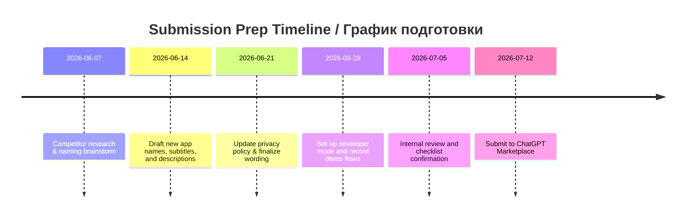

# Executive Summary / Краткое резюме
We analyzed the **Telegram–ChatGPT integration landscape**. Key players include:
- **TeleClaw (Telegram)** – a plug‑and‑play AI assistant bot for Telegram (supports group chats, multi-language, context memory). Free tier available; Pro (~$19/mo) adds advanced models and features. TeleClaw claims **strong privacy** (no logs or training on user messages, end-to-end encryption). Its UX is seamless (add @claw, works instantly). Strengths: easy setup, group‑aware; Weaknesses: not open‑source, limited custom data access. Some users laud its accuracy and language support (no direct user reviews found, but Tech blog analysis notes its robust design).
- **Composio (Web Service)** – a developer-focused integration platform. Their **Telegram Connector** lets ChatGPT (via an MCP server) “summarize unread updates, draft replies, fetch contact details,” and perform actions like sending or editing messages. It supports full **read/write** Telegram API (“Answer callback queries, Forward Message, Edit Message, Get Chat History, etc.”). Pricing is usage-based for Composio’s services. Privacy: data flows through Composio’s OAuth‐protected MCP server; security notes advise reviewing scopes and enabling manual review of actions. UX: technical (requires ChatGPT Developer Mode setup and approving Composio MCP URL). Strengths: **fine‑grained control** and multi‑app chaining; Weaknesses: complexity, targetted at developers/businesses. No known user reviews; it’s noted as “trusted by” tech companies on the site.
- **Onlizer (Web App)** – a no‑code automation builder. Their **“ChatGPT + Telegram Bot” integration** advertises easy, visual connection between ChatGPT and a Telegram Bot. Core features include sending/receiving messages, syncing contacts and deals (CRM context), and triggering ChatGPT based on chat events. Pricing: 30‑day free trial then paid (details on site but not specified). Privacy/security depend on Onlizer’s policies (not detailed on page). UX: geared to business users with drag‑and‑drop interface. Strengths: broad workflow automation; Weaknesses: not consumer‑focused, no Telegram search or personalization.
- **Rescrito (Free ChatGPT on Telegram)** – a Spanish-based service for students. It offers “ChatGPT on Telegram” to answer questions and help with essays. Features: basic Q&A, idea generation, essay assistance. It provides 10,000 free “tokens” on signup. Pricing: likely freemium (site mentions subscription for advanced use). Privacy: uses Digitup Studio’s backend (stores prompts and outputs). UX: user adds Rescrito’s bot in Telegram and chats normally. Strengths: **tailored to academic use**, multilingual. Weaknesses: limited to educational tasks, stores user data (prompts, essays) on its servers. Customer quotes on site are positive (e.g. “Rescrito is my best friend for studying!!!”).
- **AI Perfect Assistant (Multi-platform)** – a productivity app with a Telegram component. Core Telegram features: grammar/tone fixing, drafting and paraphrasing, summarization, translation, etc., all within Telegram chats. It’s a paid app (Office365‑style licensing): free tier (10 prompts/month) vs Premium (~$17‑26/mo). Privacy: GDPR‑compliant claims, “we don’t store your documents or emails” and encrypt data. UX: uses a Telegram bot named “AI Perfect Assistant”; workflow is “choose prompt→generate→copy to chat”. Strengths: many canned tasks (60+ tools), multi‑app bundle; Weaknesses: not free, potential Microsoft‑centric feel. I see no public user reviews for the Telegram bot specifically.
- **ChatGPT Quick Reply (Android)** – an Android client integrating Telegram with ChatGPT. It injects AI replies into Telegram chats. Features (user‑noted): quick reply suggestions based on chat history, multilingual support, grammar corrections. Pricing/Model: unclear (seems free app). Privacy: Some users worried it requires Telegram login and 2FA, so data goes through the developer’s service (dev hinted at adding “use your own API key” for privacy). UX: works as an overlay on Telegram UI. Strengths: tight integration (inline reply suggestions); Weaknesses: privacy concerns (sends 2FA code to app author, per comments), closed‑source. No official reviews, but Reddit users are generally impressed by the idea.
- **Telegram Digest MCP (Open-Source)** – a community tool (not a hosted app). It’s a local Python CLI that connects to ChatGPT via MCP to **summarize Telegram chats**. Core features: incremental summaries, key action extraction, exports to Markdown/JSON/HTML. Pricing: free (open source). Privacy: uses the user’s local Telegram session (no data sent to external servers). UX: command‑line driven; target is tech-savvy users. Strengths: full privacy (local), specialized summarization; Weaknesses: not user-friendly for average users, requires setup. No formal reviews (Reddit post by author only).

## Comparison Table of Key Competitors / Сравнительная таблица
| **Competitor**            | **Platform**  | **Key Features**                                | **Pricing**                  | **Privacy/Security**                     | **Strengths**                     | **Weaknesses**                              |
|---------------------------|---------------|-------------------------------------------------|------------------------------|-------------------------------------------|------------------------------------|---------------------------------------------|
| **TeleClaw** | Telegram bot | ChatGPT/Gemini/Claude answers, chat summaries, multi-language, context memory | Free tier; Pro ~$19/mo | No logs; TLS & AES‑256 encryption | Instant setup; group-aware; flat pricing | Closed-source; limited customization |
| **Composio (Connect)** | Web/MCP      | Telegram API (read/write): search chats, send/edit messages, threads, bot actions | Enterprise pricing (API usage) | OAuth token scope control; recommends manual review | Full-featured integration; multi-app chaining | Complex setup (Dev Mode, MCP URL)            |
| **Onlizer Chats**    | Web/No-code  | ChatGPT <> Telegram Bot sync: msg notifications, CRM sync, automated posting | 7-day trial, then paid (per usage) | Standard SaaS security (TLS); privacy policy unclear | No-code automation; multi-messenger support | Not consumer‑focused; no built-in AI prompt engine |
| **Rescrito**   | Telegram bot | Q&A, essay help, idea generation for students   | Freemium (10k free tokens)    | Stores user prompts and results | Student‑oriented; multilingual         | Limited scope; data retention of prompts      |
| **AI Perfect Assistant** | Telegram bot (and Office add-ins) | Grammar/tone fix, rewrite, summarize, translate | Free (10 msgs/mo); Premium $17–26/mo | GDPR‑compliant (no document storage) | 60+ AI tools; multi-platform       | Subscription; office-centric workflow         |
| **ChatGPT Quick Reply** | Android app  | In-app reply suggestions, grammar help, AI replies | Unknown (likely free)        | Uncertain (requires Telegram credentials) | Integrates directly into Telegram UI | Privacy risk (2FA shared with dev)           |
| **Telegram Digest (MCP)** | Local tool   | Automated chat summarization, action extraction | Free (open source)           | Local session (no external data) | Full privacy; detailed summaries    | CLI only; setup required                    |

*(Table: core features and models of key Telegram–AI integrations, based on sources.)*

## SWOT Analysis (Our App vs. Top Competitors) / SWOT-анализ (Наше приложение vs Конкуренты)
- **Strengths (Сильные стороны):** Our app uniquely **connects your personal Telegram account** to ChatGPT inside its interface. It can list dialogs, retrieve recent messages, summarize conversations, draft and send replies, and pin or unpin messages under the user’s control. Unlike read-only assistants, it supports explicit write actions such as sending replies and changing pin state. Message contents are fetched only for requested operations and are not persisted by the service.
- **Weaknesses (Слабые стороны):** It requires users to have access to ChatGPT Apps. Its multi-step OAuth setup is more complex than simple bots. It is less polished on mobile than Telegram-native bots or Android integrations. Some features, such as full conversation memory, may be limited by ChatGPT’s context.
- **Opportunities (Возможности):** We can position the app as an *“AI personal assistant for your Telegram”* in English and Russian while accurately describing TLS-protected transport, encrypted session storage, transient message processing, and supported actions such as dialog listing, recent-message retrieval, sending, and pinning.
- **Threats (Угрозы):** OpenAI or Telegram could introduce overlapping native integrations. Other bots and integration platforms may also compete for the same users. Regulatory and privacy scrutiny applies because a hosted service processes Telegram content and stores encrypted session credentials and operational metadata.

## Name and Description Optimization / Оптимизация названия и описания
**Proposed Names:**
1. *Telegram AI Assistant* — simple and descriptive. **(Телеграм ИИ Ассистент)** – Подчёркивает, что сервис превращает Telegram в умный помощник.
2. *ChatGPT Telegram Connector* — emphasizes bridging ChatGPT and Telegram. **(ChatGPT Телеграм Коннектор)** – Четко говорит, что связь между Telegram и ChatGPT.
3. *Telegram Manager for ChatGPT* — highlights managing Telegram via ChatGPT. **(Менеджер Telegram для ChatGPT)** – Имя намекает на функции управления чатами внутри ChatGPT.
4. *TeleGPT Bridge* — a concise English portmanteau. **(Телеграм-Бридж GPT)** – Кратко, легко запомнить; отражает «мост» между Telegram и GPT.
5. *GPTelegram* — another blend. **(GPTелеграм)** – Акцент на GPT + Telegram, звучит дружелюбно.
6. *MyGPT for Telegram* — personalizes the assistant. **(Мой GPT для Телеграма)** – Ориентировано на личный контроль и аккаунт пользователя.

**Alternate Subtitles (≤30 chars):**
- English: “Manage Telegram via ChatGPT” (27 chars). Russian: “Управляй Telegram через ChatGPT” (26).
- English: “AI‑powered Telegram workflows”. Russian: “AI‑базир. работа с Telegram”.
- English: “Read, summarize & send chats”. Russian: “Чтение, сводка и отправка чатов”.

**App Descriptions:**
- *Short (Public Directory)* – English & Russian:
  - **English:** “Connect your Telegram to ChatGPT. Read recent messages, draft and send replies, and pin or unpin messages—all via an AI assistant. Securely integrate your personal Telegram account with ChatGPT to streamline messaging tasks.”
  - **Russian:** «Соедините свой Telegram с ChatGPT. Читайте недавние сообщения, формулируйте и отправляйте ответы, закрепляйте или открепляйте сообщения — всё через вашего ИИ-ассистента.»

- *Longer (Reviewer-focused)* – English & Russian:
  - **English (reviewer):** “**Telegram‑ChatGPT Sync** connects a Telegram account to ChatGPT. It can retrieve recent message history, summarize chats, draft replies, send messages, and prepare or apply pin changes. Sending is preview-only by default. When live sending is enabled and all access gates pass, `send_message` sends immediately; the service does not implement an additional edit-and-confirm step. Pin changes use a separate prepare-and-confirm flow. Connections use TLS in transit. Message contents are fetched live for the requested operation and are not persisted. The hosted service temporarily processes plaintext message content and stores Telegram account metadata, an AES-256-GCM encrypted MTProto session, hashed OAuth refresh tokens, OAuth client metadata, and redacted tool-audit records. ChatGPT, mctl-telegram, and Telegram participate in processing the request. Users connect through OAuth and can revoke or delete their account.”
  - **Russian (reviewer):** «**Синхронизация Telegram и ChatGPT** подключает аккаунт Telegram к ChatGPT. Сервис получает недавние сообщения, суммирует диалоги, создаёт черновики, отправляет сообщения и управляет закреплением. По умолчанию отправка работает в режиме предварительного просмотра. Когда реальная отправка включена и проверки доступа пройдены, `send_message` отправляет сообщение сразу, без дополнительного шага редактирования и подтверждения на стороне сервиса. Для закрепления используется отдельный процесс подготовки и подтверждения. Соединения защищены TLS. Содержимое сообщений обрабатывается временно и не сохраняется. Сервис хранит метаданные Telegram-аккаунта, зашифрованную AES-256-GCM сессию MTProto, хэши OAuth refresh-токенов, метаданные OAuth-клиента и редактированные записи аудита инструментов. В обработке запроса участвуют ChatGPT, mctl-telegram и Telegram. Пользователь может отозвать доступ или удалить аккаунт.»

## Recommendations for Submission Materials / Рекомендации по подготовке и подаче
- **App & Privacy Description:** State the hosted trust boundary directly. ChatGPT provides the tool request, mctl-telegram processes it and communicates with Telegram, and Telegram supplies or receives the requested data. Message content is not persisted, while encrypted MTProto sessions, Telegram account metadata, hashed OAuth refresh tokens, OAuth client metadata, and redacted audit records are retained as described in the privacy policy. Distinguish TLS in transit from AES-256-GCM session encryption at rest.
- **Demo Checklist:** Build a step-by-step demo that shows each claim. Include opening ChatGPT, adding the MCP URL, authorizing Telegram access, and using the available tools. Demonstrate listing dialogs, retrieving recent messages from a dummy chat, requesting a summary, previewing a send while live sending is disabled, and using the prepare-and-confirm pin flow. Do not imply that live `send_message` has a server-side confirmation step. Make sure no real private text is visible.
- **MCP Submission Tips:** Include working callback and server URLs, the privacy policy URL, and the app icon. Disclose stored Telegram account metadata, encrypted MTProto sessions, hashed OAuth refresh tokens, OAuth client metadata, and 90-day redacted audit records. State separately that message bodies, phone numbers, and passwords are not persisted. Avoid claims that ChatGPT alone processes data or that the service provides end-to-end encryption.

**Sources:** Official documentation and sites for each tool. These were used to compare features, pricing, and privacy/security practices.
