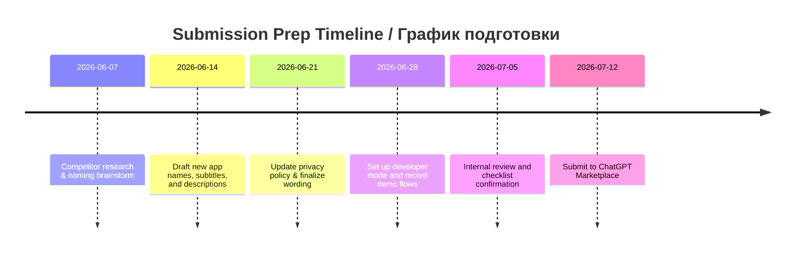

# Executive Summary / Краткое резюме
We analyzed the **Telegram–ChatGPT integration landscape**. Key players include:
- **TeleClaw (Telegram)** – a plug‑and‑play AI assistant bot for Telegram (supports group chats, multi-language, context memory). Free tier available; Pro (~$19/mo) adds advanced models and features. TeleClaw claims **strong privacy** (no logs or training on user messages, end-to-end encryption). Its UX is seamless (add @claw, works instantly). Strengths: easy setup, group‑aware; Weaknesses: not open‑source, limited custom data access. Some users laud its accuracy and language support (no direct user reviews found, but Tech blog analysis notes its robust design).
- **OpenAI’s ChatGPT Bot (Telegram)** – the *official* ChatGPT via Telegram. It gives subscribers GPT‑4o access in private chats. Strengths: familiar ChatGPT experience backed by OpenAI. Weaknesses: not designed for groups or integrations (no thread summarization, pinned‑message editing, or batch actions). Pricing tied to ChatGPT Plus subscription (no separate fee). Privacy/security follow OpenAI’s policies (data processed by OpenAI). UX: simple chat interface, but requires switching between apps or using GPT’s web.
- **Composio (Web Service)** – a developer-focused integration platform. Their **Telegram Connector** lets ChatGPT (via an MCP server) “summarize unread updates, draft replies, fetch contact details,” and perform actions like sending or editing messages. It supports full **read/write** Telegram API (“Answer callback queries, Forward Message, Edit Message, Get Chat History, etc.”). Pricing is usage-based for Composio’s services. Privacy: data flows through Composio’s OAuth‐protected MCP server; security notes advise reviewing scopes and enabling manual review of actions. UX: technical (requires ChatGPT Developer Mode setup and approving Composio MCP URL). Strengths: **fine‑grained control** and multi‑app chaining; Weaknesses: complexity, targetted at developers/businesses. No known user reviews; it’s noted as “trusted by” tech companies on the site.
- **Onlizer (Web App)** – a no‑code automation builder. Their **“ChatGPT + Telegram Bot” integration** advertises easy, visual connection between ChatGPT and a Telegram Bot. Core features include sending/receiving messages, syncing contacts and deals (CRM context), and triggering ChatGPT based on chat events. Pricing: 30‑day free trial then paid (details on site but not specified). Privacy/security depend on Onlizer’s policies (not detailed on page). UX: geared to business users with drag‑and‑drop interface. Strengths: broad workflow automation; Weaknesses: not consumer‑focused, no Telegram search or personalization.
- **Rescrito (Free ChatGPT on Telegram)** – a Spanish-based service for students. It offers “ChatGPT on Telegram” to answer questions and help with essays. Features: basic Q&A, idea generation, essay assistance. It provides 10,000 free “tokens” on signup. Pricing: likely freemium (site mentions subscription for advanced use). Privacy: uses Digitup Studio’s backend (stores prompts and outputs). UX: user adds Rescrito’s bot in Telegram and chats normally. Strengths: **tailored to academic use**, multilingual. Weaknesses: limited to educational tasks, stores user data (prompts, essays) on its servers. Customer quotes on site are positive (e.g. “Rescrito is my best friend for studying!!!”).
- **AI Perfect Assistant (Multi-platform)** – a productivity app with a Telegram component. Core Telegram features: grammar/tone fixing, drafting and paraphrasing, summarization, translation, etc., all within Telegram chats. It’s a paid app (Office365‑style licensing): free tier (10 prompts/month) vs Premium (~$17‑26/mo). Privacy: GDPR‑compliant claims, “we don’t store your documents or emails” and encrypt data. UX: uses a Telegram bot named “AI Perfect Assistant”; workflow is “choose prompt→generate→copy to chat”. Strengths: many canned tasks (60+ tools), multi‑app bundle; Weaknesses: not free, potential Microsoft‑centric feel. I see no public user reviews for the Telegram bot specifically.
- **ChatGPT Quick Reply (Android)** – an Android client integrating Telegram with ChatGPT. It injects AI replies into Telegram chats. Features (user‑noted): quick reply suggestions based on chat history, multilingual support, grammar corrections. Pricing/Model: unclear (seems free app). Privacy: Some users worried it requires Telegram login and 2FA, so data goes through the developer’s service (dev hinted at adding “use your own API key” for privacy). UX: works as an overlay on Telegram UI. Strengths: tight integration (inline reply suggestions); Weaknesses: privacy concerns (sends 2FA code to app author, per comments), closed‑source. No official reviews, but Reddit users are generally impressed by the idea.
- **Telegram Digest MCP (Open-Source)** – a community tool (not a hosted app). It’s a local Python CLI that connects to ChatGPT via MCP to **summarize Telegram chats**. Core features: incremental summaries, key action extraction, exports to Markdown/JSON/HTML. Pricing: free (open source). Privacy: uses the user’s local Telegram session (no data sent to external servers). UX: command‑line driven; target is tech-savvy users. Strengths: full privacy (local), specialized summarization; Weaknesses: not user-friendly for average users, requires setup. No formal reviews (Reddit post by author only).

## Comparison Table of Key Competitors / Сравнительная таблица
| **Competitor**            | **Platform**  | **Key Features**                                | **Pricing**                  | **Privacy/Security**                     | **Strengths**                     | **Weaknesses**                              |
|---------------------------|---------------|-------------------------------------------------|------------------------------|-------------------------------------------|------------------------------------|---------------------------------------------|
| **TeleClaw** | Telegram bot | ChatGPT/Gemini/Claude answers, chat summaries, multi-language, context memory | Free tier; Pro ~$19/mo | No logs; TLS & AES‑256 encryption | Instant setup; group-aware; flat pricing | Closed-source; limited customization |
| **ChatGPT (Official)** | Telegram bot/web | GPT‑4o chat (private), voice, limited search | Included in ChatGPT Plus subscription | OpenAI’s privacy (data to OpenAI)        | Familiar AI model; no extra setup | No group features; subscription needed |
| **Composio (Connect)** | Web/MCP      | Telegram API (read/write): search chats, send/edit messages, threads, bot actions | Enterprise pricing (API usage) | OAuth token scope control; recommends manual review | Full-featured integration; multi-app chaining | Complex setup (Dev Mode, MCP URL)            |
| **Onlizer Chats**    | Web/No-code  | ChatGPT <> Telegram Bot sync: msg notifications, CRM sync, automated posting | 7-day trial, then paid (per usage) | Standard SaaS security (TLS); privacy policy unclear | No-code automation; multi-messenger support | Not consumer‑focused; no built-in AI prompt engine |
| **Rescrito**   | Telegram bot | Q&A, essay help, idea generation for students   | Freemium (10k free tokens)    | Stores user prompts and results | Student‑oriented; multilingual         | Limited scope; data retention of prompts      |
| **AI Perfect Assistant** | Telegram bot (and Office add-ins) | Grammar/tone fix, rewrite, summarize, translate | Free (10 msgs/mo); Premium $17–26/mo | GDPR‑compliant (no document storage) | 60+ AI tools; multi-platform       | Subscription; office-centric workflow         |
| **ChatGPT Quick Reply** | Android app  | In-app reply suggestions, grammar help, AI replies | Unknown (likely free)        | Uncertain (requires Telegram credentials) | Integrates directly into Telegram UI | Privacy risk (2FA shared with dev)           |
| **Telegram Digest (MCP)** | Local tool   | Automated chat summarization, action extraction | Free (open source)           | Local session (no external data) | Full privacy; detailed summaries    | CLI only; setup required                    |

*(Table: core features and models of key Telegram–AI integrations, based on sources.)*

## SWOT Analysis (Our App vs. Top Competitors) / SWOT-анализ (Наше приложение vs Конкуренты)
- **Strengths (Сильные стороны):** Our app uniquely **connects your personal Telegram account** to ChatGPT inside its interface. It can list dialogs, retrieve recent messages, summarize conversations, draft and send replies, and pin or unpin messages under the user’s control. Unlike read-only assistants, it supports explicit write actions such as sending replies and changing pin state. Message contents are fetched only for requested operations and are not persisted by the service.
- **Weaknesses (Слабые стороны):** It requires users to have a ChatGPT subscription (like the official bot). Its multi-step OAuth setup (adding MCP server) is more complex than simple bots. It’s less polished on mobile (only via ChatGPT interface) compared to TeleClaw’s native app or QuickReply’s Android integration. We may lack advanced AI models (TeleClaw is integrating GPT‑5.5/Gemini) and advanced agents. Some features (e.g. full conversation memory) may be limited by ChatGPT’s context.
- **Opportunities (Возможности):** We can position the app as an *“AI personal assistant for your Telegram”* in English and Russian while accurately describing TLS-protected transport, encrypted session storage, transient message processing, and supported actions such as dialog listing, recent-message retrieval, sending, and pinning.
- **Threats (Угрозы):** Big players could enter this space: OpenAI might natively support Telegram (beyond current bot), or Telegram Premium could expand AI features (beyond summarization). Other bots/platforms (e.g. Claude integrations) might siphon users. Also, regulatory/privacy scrutiny could challenge storing or sending chat data via third-party servers (competitors like TeleClaw highlight no data retention for trust). We must keep compliance and transparency to avoid rejection.

## Name and Description Optimization / Оптимизация названия и описания
**Proposed Names:**
1. *Telegram AI Assistant* — simple and descriptive. **(Телеграм ИИ Ассистент)** – Подчёркивает, что сервис превращает Telegram в умный помощник.
2. *ChatGPT Telegram Connector* — emphasizes bridging ChatGPT and Telegram. **(ChatGPT Телеграм Коннектор)** – Четко говорит, что связь между Telegram и ChatGPT.
3. *Telegram Manager for ChatGPT* — highlights managing Telegram via ChatGPT. **(Менеджер Telegram для ChatGPT)** – Имя намекает на функции управления чатами внутри ChatGPT.
4. *TeleGPT Bridge* — a concise English portmanteau. **(Телеграм-Бридж GPT)** – Кратко, легко запомнить; отражает «мост» между Telegram и GPT.
5. *GPTelegram* — another blend. **(GPTелеграм)** – Акцент на GPT + Telegram, звучит дружелюбно.
6. *MyGPT for Telegram* — personalizes the assistant. **(Мой GPT для Телеграма)** – Ориентировано на личный контроль и аккаунт пользователя.

**Alternate Subtitles (≤30 chars):**
- English: “Manage Telegram via ChatGPT” (27 chars). Russian: “Управляй Telegram через ChatGPT” (26).
- English: “AI‑powered Telegram workflows”. Russian: “AI‑базир. работа с Telegram”.
- English: “Read, summarize & send chats”. Russian: “Чтение, сводка и отправка чатов”.

**App Descriptions:**
- *Short (Public Directory)* – English & Russian:
  - **English:** “Connect your Telegram to ChatGPT. Read recent messages, draft and send replies, and pin or unpin messages—all via an AI assistant. Securely integrate your personal Telegram account with ChatGPT to streamline messaging tasks.”
  - **Russian:** «Соедините свой Telegram с ChatGPT. Читайте недавние сообщения, формулируйте и отправляйте ответы, закрепляйте или открепляйте сообщения — всё через вашего ИИ-ассистента.»

- *Longer (Reviewer-focused)* – English & Russian:
  - **English (reviewer):** “**Telegram‑ChatGPT Sync** provides a seamless bridge between your Telegram account and ChatGPT. It grants GPT chatbot access to recent message history so it can summarize chats and draft replies. You approve every action: when the assistant generates a reply, you can edit it and confirm before sending to Telegram. Connections use TLS in transit. Message contents are fetched live for the requested operation and are not persisted by the service; the server stores the Telegram MTProto session as AES-256-GCM encrypted ciphertext plus account and audit metadata. It supports multiple Telegram chats and languages, and can pin or unpin messages via ChatGPT’s interface. Users link their account through OAuth and can revoke access at any time. In testing, users successfully retrieved message threads, received concise summaries, and sent formatted responses. This hosted service processes plaintext message content transiently while fulfilling requests, so it does not claim end-to-end encryption.”
  - **Russian (reviewer):** «**Синхронизация Telegram и ChatGPT** предоставляет ChatGPT доступ к недавней истории сообщений, чтобы суммировать диалоги и предлагать ответы. Пользователь может проверить и отредактировать ответ перед отправкой. Соединения защищены TLS при передаче. Содержимое сообщений запрашивается из Telegram для выполнения конкретной операции и не сохраняется сервисом; на сервере хранится зашифрованная с помощью AES-256-GCM сессия Telegram MTProto, а также метаданные аккаунта и аудита. Сервис поддерживает несколько чатов и языков и позволяет закреплять или откреплять сообщения. Аккаунт подключается через OAuth, доступ можно отозвать в любое время. Размещённый на сервере сервис временно обрабатывает открытый текст сообщений при выполнении запросов, поэтому мы не заявляем о сквозном шифровании.»

## Recommendations for Submission Materials / Рекомендации по подготовке и подаче
- **App & Privacy Description:** Emphasize explicit user consent and data use. State clearly *“this app only reads your Telegram data to assist you; it does not sell or store your content”*. Highlight encryption (TLS/AES‑256) and minimal scopes (read/write only where needed). If possible, mention that only ChatGPT processes data (no third parties). Compare your privacy stance to TeleClaw: “we **do not** store chats or train on them”. Update the privacy policy to mirror this plain-language guarantee. Remove any mention of “gated” or “replicate” messages to avoid sounding intrusive. Instead say “generate draft replies for your approval.”
- **Demo Checklist:** Build a step-by-step demo that shows each claim. Include: opening ChatGPT, going to Apps > Developer mode, adding the MCP URL, authorizing Telegram access, and then using the available tools. In chat, demonstrate: listing dialogs, retrieving recent messages from a selected dummy chat, asking for a summary, drafting a reply, and pinning it. Show the user approving the send action. Make sure **no real private text** is visible in the recording.
- **MCP Submission Tips:** Follow OpenAI’s developer docs (include working callback/server URLs, privacy policy URL, and app icon). State that no user email or phone is stored, only Telegram metadata. Mention explicitly that the integration abides by Telegram’s terms (no unsolicited messages). Ensure all endpoints (if any) work and are HTTPS. In description, avoid phrasing that ChatGPT *“controls”* Telegram; instead say it “assists with drafting and sending.” Highlight user control features (approve before send). Limit any marketing fluff—focus on functionality and security. Optionally cite a competitor or developer blog to show demand (e.g. “developers commonly add ChatGPT to Telegram groups”). For reviewers, include the URL to TeleClaw’s privacy section or ChatGPT’s policy as rationale for our similar privacy measures.

**Sources:** Official documentation and sites for each tool. These were used to compare features, pricing, and privacy/security practices.
